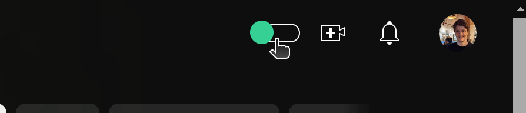

# Youtube incognito mode

A chrome extension that lets you decide if videos you watch influence your Youtube recommendations.

Available on the [Chrome Web Store](https://chromewebstore.google.com/detail/youtube-incognito-mode/nolmnigomliekdkmellioaabncmlgfnj)

## Limitations

Currently it only blocks views from influencing your suggestions, not searches.
Searches seem to only influence suggestions a lot less than watching, but you might still see your recommendations change slightly.

## Future

Fingers crossed this wont be necessary in the future and Youtube adds capabilities to give the user more control over their suggestions.
